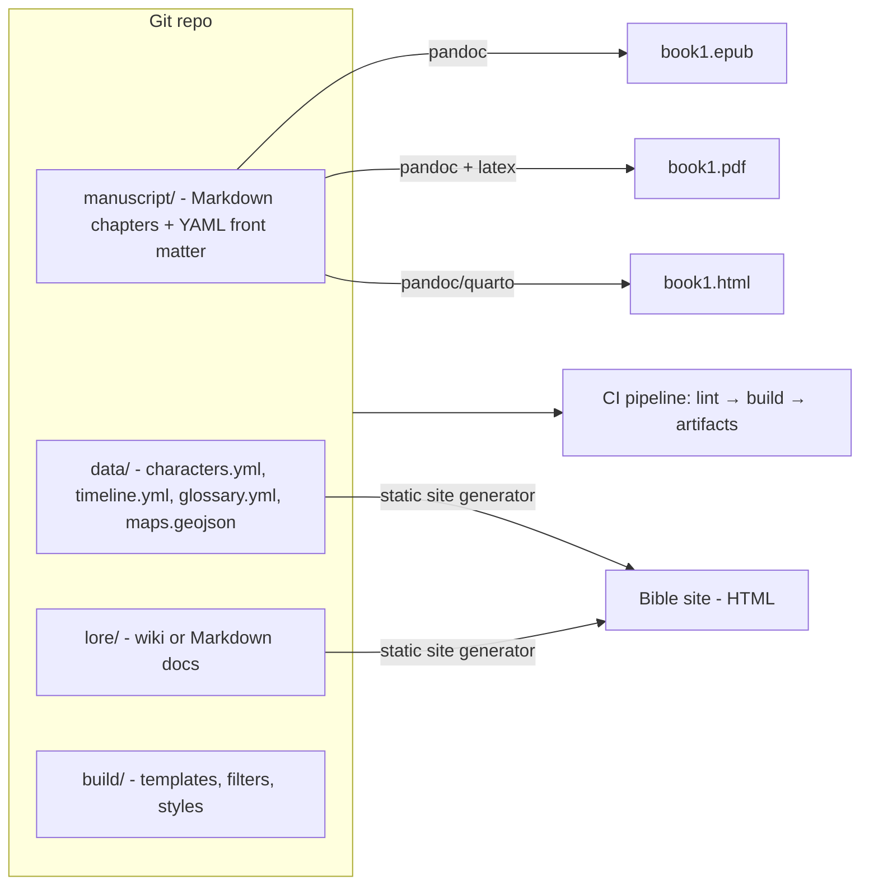

# Story-as-Code — Consolidated Landscape

> Research snapshot 2026-03. Single, reorganized, deduplicated reference for GrayArea.
> Covers tools, practices, and communities treating narrative/fiction development
> with software engineering discipline.

---

## Executive Summary

"Story-as-code" applies software engineering primitives — plain-text source, explicit schemas,
deterministic builds, automated quality checks, and collaborative review — to narrative production.
The ecosystem is an interoperability *stack*:

1. Human-friendly authoring formats (Markdown family).
2. Structured metadata (YAML/TOML/JSON).
3. Version control (git).
4. Automation/CI for exports (Pandoc/Quarto → EPUB/PDF/HTML).
5. Communities that have hardened these patterns (Docs-as-Code, interactive fiction, publishing tooling).

The most robust "novel-ready" center of gravity is **Markdown + Pandoc + git + CI** because it gives
you durable, tool-agnostic source files, multi-format export from one source, and a composable
automation story via filters, linting, and build pipelines.

### Two-plane architecture (key concept)

For **science-fiction series work**, the core challenge isn't drafting — it's *continuity at scale*:
controlled vocabularies, canonical timelines, cross-book dependencies. The canonical pattern:

| Plane | Contents | Tooling |
|-------|----------|---------|
| **Manuscript plane** | One file per scene/chapter (Markdown + front matter) | Pandoc, Vale, git |
| **Canon/bible plane** | Characters, timeline, glossary, maps (YAML/JSON/GeoJSON) | Static site, Datasette, Leaflet |

---

## Recommended Stacks

All three stacks share one invariant: **plain-text sources in git + deterministic builds**.

### Stack A — Manuscript-first Markdown pipeline *(max portability)*

**Components**
- Pandoc Markdown source (CommonMark conventions).
- Pandoc build to EPUB / PDF / HTML.
- Git hosting with branch/tag/PR workflow (GitHub or GitLab).
- CI enforcing prose QA: Vale, codespell, cspell, lychee.
- Optional Calibre `ebook-convert` for legacy formats.

**Why it is top-ranked for a trilogy**
Every asset is inspectable and diffable. Pandoc filters let you migrate formats later.
Branching, tagging, and review patterns map directly to long-running projects.

### Stack B — Fiction IDE + build pipeline hybrid *(writer UX)*

**Components**
- Draft and organize in **novelWriter** or **Manuskript** (scene/chapter UX).
- Treat the exported plaintext as the "source of truth" committed to git.
- Build outputs via Pandoc/Quarto with the same CI gates as Stack A.

**Why it is strong**
Fiction-specific ergonomics without abandoning reproducibility — the best
"writer happiness / engineering discipline" compromise for Book 1.

### Stack C — Canon-first world bible *(high continuity risk)*

**Components**
- World bible as **TiddlyWiki** (single-file, offline-first) or **Wiki.js** (collaborative server).
- Structured datasets: `characters.yml`, `timeline.yml`, `glossary.yml`, `maps.geojson`.
- Interactive views: TimelineJS, Leaflet-based maps, Datasette.
- Publish bible as static site (Hugo / MkDocs / Docusaurus).
- Manuscript still built with Pandoc (same as Stack A).

**Why it is trilogy-optimal when continuity risk is high**
Sci-fi series often fail on internal consistency. This stack makes canon *queryable and
publishable*, enabling early detection of continuity errors (e.g., "this ship class doesn't
exist until year X," "this officer cannot be on two planets simultaneously").

---

## Tool Reference

### Open Source vs Proprietary — Quick Comparison

| Category | Best Open Source | Best Proprietary |
|---|---|---|
| Narrative scripting | Ink (MIT) | ChoiceScript |
| Version control | Git + GitHub | — |
| Prose linting | Vale (MIT) | Grammarly |
| Publishing pipeline | Pandoc + Quarto | O'Reilly Atlas |
| World-building | TiddlyWiki / Obsidian | World Anvil |
| Writing IDE | novelWriter / Manuskript | Scrivener |
| Narrative design | Yarn Spinner | Articy:draft |
| Ebook conversion | Calibre | — |

---

### 1. Interactive Fiction Languages — Story *is* Code

Narrative scripting languages where prose and logic are the same artifact.
Compiled, tested, version-controlled.

| Tool | License | Primary Use | Link |
|------|---------|-------------|------|
| **Ink** | MIT | Branching narrative for games & web | https://www.inklestudios.com/ink/ |
| **Inky** (Ink IDE) | MIT | Play-as-you-write editor for Ink; exports JSON / web | https://github.com/inkle/inky |
| **Twine** | GPL | Nonlinear hypertext fiction | https://twinery.org/ |
| **Yarn Spinner** | MIT | Dialogue scripting for Unity/Godot; `ysc compile` → CSV tables | https://yarnspinner.dev/ |
| **Inform 7** | Artistic 2.0 (since 2022) | Natural-language interactive fiction; Skein = branching test tree | https://ganelson.github.io/inform-website/ |
| **Inform 6** | Artistic 2.0 | Lower-level IF programming (C-like) | https://www.inform-fiction.org/ |
| **TADS 3** | TADS License | Text adventure development system | https://www.tads.org/ |
| **Ren'Py** | MIT + LGPL | Visual novel engine with Python scripting | https://www.renpy.org/ |
| **ChoiceScript** | Proprietary | Choice-based commercial IF | https://www.choiceofgames.com/make-your-own-games/choicescript-ide/ |
| **Articy:draft** | Proprietary | Professional narrative design (AAA games) | https://www.articy.com/ |
| **ink Unity Integration** | MIT | Bridge Ink ↔ Unity | https://github.com/inkle/ink-unity-integration |

**Inky highlights:** play-as-you-write live preview; error highlighting as-you-type;
jump-to-definition on branches; export to compiled JSON and web HTML.

**Inform 7 Skein highlights:** tracks player paths as a branching tree (structural equivalent
of git branches for narrative); "blessed" transcript responses = passing tests; deviations
on replay = regression detection.

**When to use these for a linear novel:** prototyping branching scene variants, interactive
"choose-your-lore" reference docs, dialogue coverage tests, or "what-if" continuity checks.
Even if your novel is linear, Ink/Yarn are useful for *prototyping* alternate POV branches
before committing to one.

---

### 2. Version Control for Prose — Git on Fiction

| Resource | Type | Link |
|----------|------|------|
| **Git** | GPL-2.0 | https://git-scm.com/ |
| **GitHub** | Proprietary (free tier) | https://github.com/ |
| **GitLab** | CE open-source | https://gitlab.com/ |
| **Gitea / Forgejo** | MIT / GPL-3.0 (self-hosted) | https://gitea.io/ · https://forgejo.org/ |
| **Gwern.net methodology** | Public reference — essays under git, full linting pipeline, writing checklist as QA | https://gwern.net/about |
| **Manubot** | MIT — scholarly Markdown manuscripts in git with CI | https://manubot.org/ |
| **Obsidian** | Proprietary (free personal) — linked Markdown vault, graph view | https://obsidian.md/ |
| **Logseq** | AGPL-3.0 — outliner + graph, Markdown-based | https://logseq.com/ |
| **Dendron** | AGPL — VS Code native hierarchical Markdown *(maintenance mode — do not depend on new features)* | https://www.dendron.so/ |

**Git-as-narrative primitives (community pattern):**

| Git primitive | Narrative meaning |
|---|---|
| Branch | Alternate plot timeline or POV experiment |
| Commit | Scene checkpoint |
| Tag | Draft milestone (`b1-outline-v0.1`, `b1-draft1-v1.0`) |
| Pull Request | Co-author / editor review |
| Issue | Plot hole, continuity error, TODO scene |
| CI | Automated word count, lint, PDF build |

**Branching strategy for a trilogy:**
- `main` — canonical state of Book 1 + evolving bible.
- `bible` — optional protected branch for canon-only changes (glossary, tech rules, timeline).
- `experiments/*` — POV swaps, alternate scene sequences, hard-SF plausibility variants.
- Tags: `b1-outline-v0.1`, `b1-draft1-v1.0`, `b1-draft2-v2.0`, `b1-copyedit-v3.0`.

---

### 3. Prose Linting & Quality Automation

| Tool | License | What It Does | Link |
|------|---------|--------------|------|
| **Vale** | MIT | Style linting — enforce house style, flag weak words; CLI + LSP | https://vale.sh/ |
| **vale-vscode** | MIT | Real-time Vale lint in VS Code (uses vale-ls) | https://github.com/chrischinchilla/vale-vscode |
| **proselint** | BSD | Flags bad habits, anachronisms, redundancy | https://github.com/amperser/proselint |
| **write-good** | MIT | Passive voice, weasel words, adverb overuse | https://github.com/btford/write-good |
| **alex** | MIT | Flags insensitive language | https://alexjs.com/ |
| **LanguageTool** | LGPL core / proprietary cloud | Grammar, style, consistency | https://languagetool.org/ |
| **codespell** | GPL-2.0 | Common misspellings; fast | https://github.com/codespell-project/codespell |
| **cspell** | MIT | Configurable spell checker with CLI and vocabulary support | https://cspell.org/ |
| **markdownlint-cli2** | MIT | Markdown structure and style | https://github.com/DavidAnson/markdownlint-cli2 |
| **lychee** | MIT / Apache-2.0 | Fast link checker for Markdown/HTML | https://lychee.cli.rs/ |
| **pre-commit** | MIT | Hook framework — enforces checks before every commit | https://pre-commit.com/ |
| **textlint** | MIT | Pluggable text linter; NLP rules available | https://textlint.github.io/ |
| **Grammarly** | Proprietary | Grammar + style AI | https://www.grammarly.com/ |
| **Hemingway App** | Proprietary (free web) | Readability scoring | https://hemingwayapp.com/ |

> **Note on vale-vscode:** as of late 2025 it underwent an architectural shift to the Vale
> Language Server. Active engineering but breaking changes possible — pin versions in CI.

---

### 4. Publishing Pipelines

Treating prose manuscripts like software deliverables — built, versioned, published.

| Tool | License | Link | Notes |
|------|---------|------|-------|
| **Pandoc** | GPL-2.0 | https://pandoc.org/ | Universal converter; filterable AST; canonical build engine |
| **Quarto** | MIT | https://quarto.org/ | Project system on top of Pandoc; multi-format; batteries-included |
| **mdBook** | MPL-2.0 | https://rust-lang.github.io/mdBook/ | Fast HTML book sites; EPUB/PDF less central |
| **Sphinx** | BSD | https://www.sphinx-doc.org/ | Strong cross-references; more "docs" than "novel" |
| **Asciidoctor** | MIT | https://asciidoctor.org/ | Rich includes/partials; AsciiDoc learning curve vs Markdown |
| **bookdown** | GPL-3.0 | https://bookdown.org/ | R Markdown → book; hosted service sunset **Mar 31 2026** — use package only |
| **Hugo** | Apache-2.0 | https://gohugo.io/ | Fast static site; front matter in YAML/TOML/JSON; ideal for bible sites |
| **MkDocs** | BSD | https://www.mkdocs.org/ | Simple; docs-navigation out of the box |
| **Docusaurus** | MIT | https://docusaurus.io/ | React-based; versioned docs ("v1 canon", "v2 retcons") |
| **Eleventy (11ty)** | MIT | https://www.11ty.dev/ | Data-driven pages from JSON/YAML; generate character sheets |
| **Jekyll** | MIT | https://jekyllrb.com/ | GitHub Pages heritage; Ruby toolchain |
| **HonKit** | MIT | https://honkit.netlify.app/ | GitBook-style site |
| **WeasyPrint** | BSD | https://weasyprint.org/ | CSS paged media → PDF; no LaTeX required |
| **Paged.js** | MIT | https://pagedjs.org/ | CSS paged media in browser → print/PDF |
| **Eisvogel** | BSD-3-Clause | https://github.com/Wandmalfarbe/pandoc-latex-template | Maintained Pandoc LaTeX template for styled PDFs |
| **pandoc-crossref** | GPL-2.0 | https://github.com/lierdakil/pandoc-crossref | Pandoc filter for numbering and cross-references; tracks Pandoc compat |
| **Calibre / ebook-convert** | GPL-3.0 | https://calibre-ebook.com/ | CLI format conversion; use for MOBI/AZW3 legacy outputs |
| **O'Reilly Atlas** | Proprietary | https://atlas.oreilly.com/ | Professional git-backed publishing |
| **Leanpub** | Proprietary (free tier) | https://leanpub.com/ | Markdown → self-published book with live preview |

> **MOBI note (2026):** Kindle Direct Publishing dropped reflowable MOBI support in 2021 and
> fixed-layout MOBI in 2025. Prioritize EPUB for Kindle; keep MOBI only for legacy/testing.
> Use Calibre's `ebook-convert` when legacy formats are genuinely required.

**CI/CD patterns for writing:**
- GitHub Actions + Pandoc: auto-build PDF/EPUB on every push to `main`.
- Word-count tracking per commit (narrative velocity metric).
- Automated chapter/front matter structure validation via markdownlint + YAML schema check.

---

### 5. Narrative Design (Game Studio Patterns)

How AAA and indie studios manage story as engineering — useful as reference patterns
even for linear novels.

| Tool | License | Link |
|------|---------|------|
| **Articy:draft 3** | Proprietary | https://www.articy.com/ — full narrative editor: flowcharts, dialogue, variables |
| **Twine** (also used by studios) | GPL | https://twinery.org/ |
| **Dialogic (Godot plugin)** | MIT | https://github.com/dialogic-godot/dialogic — visual dialogue system |
| **Ink + Unity** | MIT | https://github.com/inkle/ink-unity-integration — industry-standard branching narrative |
| **ChatMapper** | Proprietary | https://www.chatmapper.com/ — NPC dialogue tree design |
| **Machinations** | Proprietary (free tier) | https://machinations.io/ — pacing/economy modeling |

---

### 6. World-Building & Story Bible Management

Organizing lore, canon, and continuity — the "source of truth" problem.

| Tool | License | Link | Notes |
|------|---------|------|-------|
| **TiddlyWiki** | BSD | https://tiddlywiki.com/ | Self-contained single HTML file; ultra-portable; offline; extensible |
| **Wiki.js** | AGPL-3.0 | https://js.wiki/ | Self-hosted; multi-user; permissions; git-backed storage |
| **Logseq** | AGPL-3.0 | https://logseq.com/ | Outliner + backlink graph; Markdown; daily notes; exports require planning |
| **World Anvil** | Proprietary (free tier) | https://www.worldanvil.com/ | Timeline, genealogy, maps; cloud-only |
| **Campfire** | Proprietary (free tier) | https://www.campfirewriting.com/ | Characters, timelines, maps |
| **Notion** | Proprietary (free tier) | https://www.notion.so/ | General wiki, widely used as story bible |
| **Obsidian** | Proprietary (free personal) | https://obsidian.md/ | Local Markdown vault; graph view; no vendor lock-in |

**Sci-fi canon data files (recommended pattern):**
- `glossary.yml` — canonical spelling, pronunciation notes, "first appearance" scene reference.
- `timeline.yml` — absolute dates/events with book/scene references.
- `characters.yml` — factions, rank progression, relationship edges.
- `maps.geojson` — locations (even fictional coordinate systems) to drive map renderers.

Render these into human-friendly views: static pages (Hugo/MkDocs) or interactive views
(TimelineJS for chronology, Leaflet for maps, Datasette for queryable tables).

---

### 7. Fiction-Specific Writing Environments

IDEs built specifically for long-form prose.

| Tool | License | Link |
|------|---------|------|
| **novelWriter** | GPL-3.0 | https://novelwriter.io/ — Markdown-based, long-form, minimal; novel-specific UX |
| **Manuskript** | GPL-3.0 | https://www.theologeek.ch/manuskript/ — open-source Scrivener alternative; planning aids |
| **Zettlr** | GPL-3.0 | https://www.zettlr.com/ — Markdown + citations; Pandoc export hooks |
| **VS Code** | MIT | https://code.visualstudio.com/ — with Markdown + Vale + Mermaid extensions |
| **Scrivener** | Proprietary | https://www.literatureandlatte.com/scrivener — industry standard; cork board, compiler |
| **Ulysses** | Proprietary (subscription, macOS/iOS) | https://ulysses.app/ — Markdown-first, distraction-free |
| **iA Writer** | Proprietary (one-time) | https://ia.net/writer — minimal Markdown, focus mode |

---

### 8. Visualization, Maps & Structured Data

| Tool | License | Link | Use |
|------|---------|------|-----|
| **Mermaid** | MIT | https://github.com/mermaid-js/mermaid | Diagrams-as-code: relationship graphs, fleet hierarchies, plot flowcharts |
| **Graphviz** | CPL-1.0 | https://graphviz.org/ | Static graph rendering |
| **PlantUML** | GPL | https://plantuml.com/ | UML-style diagrams |
| **TimelineJS** | MPL-2.0 | https://timeline.knightlab.com/ | Interactive timelines from Google Sheets or JSON |
| **Leaflet** | BSD-2-Clause | https://leafletjs.com/ | Interactive maps + GeoJSON overlays |
| **OpenLayers** | BSD | https://openlayers.org/ | Feature-rich web maps |
| **MapLibre GL JS** | BSD | https://maplibre.org/ | Vector tile maps |
| **Datasette** | Apache-2.0 | https://datasette.io/ | Queryable SQLite → character/ship/planet databases |

---

### Full Tooling Comparison Table

Focused on projects most relevant to a Book 1 novel workflow (drafting + bible + build/export + QA + publishing).

| Project | Purpose | Formats | License | Activity | Pros / Cons | Ideal use-case |
|---|---|---|---|---|---|---|
| Pandoc | Universal document conversion; build EPUB/PDF/HTML/DOCX | Pandoc Markdown; metadata blocks; many in/out | GPL-2.0 | Active | **+** broad format coverage; filterable AST. **−** output tuning needs templates/LaTeX/CSS | Canonical build engine for trilogy manuscripts |
| Quarto | Project system on top of Pandoc; multi-format publishing | Markdown + YAML; project configs | MIT | Active | **+** batteries-included scaffolding; multi-output. **−** optimized for tech publishing; can feel heavy | Book-style site + EPUB/PDF builds with a project framework |
| mdBook | Build "book websites" from Markdown | Markdown | MPL-2.0 | Active | **+** fast; strong HTML book UX. **−** EPUB/PDF less central | Publish series bible or "making-of" web book |
| Sphinx | Docs-as-code engine; cross-references | reStructuredText / Markdown (MyST) | BSD | Active | **+** mature; cross-refs. **−** more "docs" than "novel"; LaTeX complexity | Publishing world bible as structured documentation |
| Asciidoctor | AsciiDoc processing; book-scale structured authoring | AsciiDoc; HTML/PDF/EPUB | MIT | Mature | **+** includes/partials; long-doc ergonomics. **−** AsciiDoc learning curve | Appendix-heavy books or heavily structured bible |
| bookdown | R Markdown book publishing | R Markdown; PDF/EPUB/HTML | GPL-3.0 | Active package; hosted sunsets Mar 2026 | **+** book-centric features. **−** overkill for pure fiction; don't use hosted surface | If you already use RMarkdown/Quarto |
| Hugo | Fast static site generator | Markdown + front matter (YAML/TOML/JSON) | Apache-2.0 | Active | **+** very fast; rich front matter. **−** theme/config complexity | Publish canonical "Series Bible" website from git |
| MkDocs | Static docs/site generator | Markdown | BSD | Active | **+** simple; docs-friendly nav. **−** less "bookish" by default | Low-friction bible site with search/navigation |
| Docusaurus | React docs site; versioned knowledge bases | Markdown/MDX | MIT | Active | **+** modern UI, search, versioning. **−** JS build overhead | Versioned bible docs ("v1 canon", "v2 retcons") |
| Eleventy | Flexible static site generator | Markdown + JSON/YAML data files | MIT | Active | **+** data-driven pages; flexible. **−** less opinionated; you build conventions | Generate character database pages from YAML |
| Jekyll | Ruby-based static site | Markdown + front matter | MIT | Mature; maintained | **+** large ecosystem; GitHub Pages. **−** Ruby toolchain | Simple bible site hosted via GitHub Pages |
| HonKit | GitBook-like docs/book site | Markdown | MIT | Active | **+** familiar GitBook style; simple. **−** smaller ecosystem | Fast, GitBook-style story bible |
| novelWriter | Fiction-focused IDE for long-form drafting | Plaintext/Markdown-oriented | GPL-3.0 | Active OSS | **+** novel-specific UX; scenes/chapters. **−** still needs external build discipline | Drafting Book 1 with scene-level structure |
| Manuskript | Fiction writing tool (Scrivener-like) | Project format; exports | GPL-3.0 | Active | **+** planning aids; OSS. **−** export/build may need external tooling | Writers wanting a planning+drafting GUI |
| Zettlr | Markdown editor for research + longform | Markdown; citations; Pandoc export | GPL-3.0 | Active | **+** writing + citations; export hooks. **−** less fiction-specific | SF research + drafting notes with consistent exports |
| TiddlyWiki | Single-file / self-hosted wiki for lore | Tiddlers (wiki text / JSON); single HTML | BSD | Active | **+** ultra-portable; offline; extensible. **−** multi-author scaling needs conventions | Personal "series bible in one file" + portable canon |
| Wiki.js | Server wiki with git-backed workflows | Markdown; git storage | AGPL-3.0 | Active | **+** multi-user; permissions; git sync. **−** server ops; AGPL if modified | Collaborative bible for co-authors/editors |
| Logseq | Outliner + graph knowledge base | Markdown/Org blocks | AGPL-3.0 | Active | **+** graph thinking; daily notes. **−** app-level workflow; exports need planning | Research + worldbuilding with backlink graph |
| Ink | Narrative scripting language; branching logic | .ink source → compiled JSON | MIT | Mature; active docs | **+** deterministic compilation; great for branching prototypes. **−** not a novel formatter | Alternate POV branches; dialogue prototyping; continuity tests |
| Inky | Ink IDE (play-as-you-write) | .ink; exports web/JSON | MIT | Active | **+** tight Ink workflow; live preview. **−** niche if you don't use Ink | Author branching scenes for later linearization |
| Twine + Twee 3 | Hypertext fiction; text-based via Twee 3 spec | Twine HTML; Twee 3 text | GPL (Twine); specs open | Active community | **+** visual graph; text source via Twee. **−** linear novel conversion is non-trivial | Mapping branching plot options; interactive appendices |
| Yarn Spinner + ysc | Dialogue scripting and compilation | .yarn; .yarnproject JSON; .yarnc + CSV | MIT | Active | **+** plain-text dialogue; compiler outputs tables/metadata. **−** engine-oriented | Dialogue-heavy SF scenes; export line tables for review |
| Inform | Interactive fiction authoring system | Source → IF artifacts | Artistic-2.0 | Open-source repo | **+** strong "test transcripts" culture. **−** specialized | Mechanically testable IF side projects or lore simulators |
| Ren'Py | Visual novel engine, Python scripting | Script + assets | MIT + LGPL | Active | **+** strong for VN prototypes. **−** game pipeline overhead | Prototype character/scene interactions; later novelize |
| Vale | Prose linter; "code review for writing" | Rules + config; Markdown/AsciiDoc/etc | MIT | Active; LSP | **+** customizable style; CI-friendly. **−** rule curation work upfront | Enforce glossary/canon spellings; catch weak prose patterns |
| vale-vscode | In-editor Vale for VS Code | Editor integration; uses vale-ls | MIT | Active fork | **+** real-time lint feedback. **−** LSP transition period; pin versions | "Lint as you write" in VS Code |
| pre-commit | Hook framework; enforces checks before commits | Hook configs (YAML) | MIT | Active | **+** standardizes checks across machines. **−** initial setup overhead | Every commit passes lint/format/metadata validation |
| Calibre + ebook-convert | Ebook format conversion toolchain | Many ebook formats; CLI | GPL-3.0 | Active; frequent releases | **+** practical format conversion; CLI. **−** heavyweight dependency | Convert EPUB to MOBI/AZW3 when required |

---

## Technical Architecture

### Source graph and build graph

| Concept | What it means |
|---------|--------------|
| **Source graph** | Repo contains: manuscript text, structured metadata, bible artifacts, build tooling. Durability depends on formats with plural tooling and explicit semantics (schemas, tests). |
| **Build graph** | Deterministic compilation: source → EPUB/PDF/HTML/print. The more your pipeline resembles a software build (pinned versions, stable templates, lint gates), the easier it is to maintain across three books. |

### Markdown dialects — choosing one

| Dialect | Notes |
|---------|-------|
| **CommonMark** | Standardized spec; reduces ambiguity across renderers |
| **GitHub Flavored Markdown (GFM)** | Extends CommonMark with tables, task lists; what GitHub renders |
| **Pandoc Markdown** | Superset adding metadata blocks, footnotes, citations, math, raw includes — **recommended for trilogy manuscripts** |

**Key policy:** standardize on Pandoc Markdown and lint/preview against *the same engine used
for releases*. Mixing renderers (GitHub preview, local extensions, CI) causes subtle output drift.

### Front matter conventions

Store per-file metadata in YAML front matter. Validate this schema in CI.

```yaml
---
title: "The Rubenstein Migration"
book: 1
chapter: 2
scene: 3
pov: "Elijah Williams"
location: "Old Grand Central, Manhattan"
date_story: "2274-09-14"
canon: true
---
```

### Other plain-text formats worth knowing

| Format | Notes |
|--------|-------|
| **Fountain** | Plain-text screenplay syntax; useful for dialogue-heavy scenes or audio drama side content |
| **Org-mode** | Emacs-native; publishes to HTML/LaTeX/ODT; strong outlining |
| **Twee 3** | Plain-text spec for Twine stories; diff-friendly |
| **Ink (.ink)** | Compiles to JSON runtime format; scriptable and testable |

### Reference architecture (build pipeline)



**Pandoc filters** read a JSON serialization of the Pandoc AST, transform it, and write it back.
This is the primary programmability hook: enforce scene headers, auto-expand glossary tags,
normalize em-dashes, validate POV consistency.

---

## Repo Layout

```text
GrayArea/
  README.md
  book1/
    chapters/
      00-frontmatter.md
      01-prologue.md
      02-ch01.md
      ...
    meta.yml
  lore/
    index.md
    factions.md
    technology.md
    planets.md
  data/
    characters.yml
    timeline.yml
    glossary.yml
    maps.geojson
  assets/
    images/
    maps/
  build/
    pandoc/
      defaults.yml
      epub.css
      latex-template.tex     # or vendor Eisvogel
    scripts/
      build.sh
      wordcount.sh
  qa/
    .vale.ini
    cspell.json
    .markdownlint.json
  docs/                      ← architecture, research, templates
  tools/                     ← import/transform scripts
  archive/                   ← prior drafts and bulk imports
  .github/
    workflows/
      build.yml
```

---

## CI Pipeline

### GitHub Actions workflow

```yaml
name: build-book

on:
  push:
    branches: [ "main" ]
  pull_request:

jobs:
  qa-and-build:
    runs-on: ubuntu-latest
    steps:
      - uses: actions/checkout@v4

      # QA
      - name: Install QA tools
        run: |
          python -m pip install --upgrade pip
          pip install codespell
          npm install -g cspell markdownlint-cli2

      - name: Spellcheck (codespell)
        run: codespell book1 lore data

      - name: Spellcheck (cspell)
        run: cspell "book1/**/*.md" "lore/**/*.md" "data/**/*.yml"

      - name: Markdown lint
        run: markdownlint-cli2 "book1/**/*.md" "lore/**/*.md"

      # Build
      - name: Build EPUB + PDF
        run: ./build/scripts/build.sh

      - name: Upload artifacts
        uses: actions/upload-artifact@v4
        with:
          name: book1-artifacts
          path: |
            dist/book1.epub
            dist/book1.pdf
            dist/book1.html
```

### Pre-commit config

```yaml
# .pre-commit-config.yaml
repos:
  - repo: https://github.com/codespell-project/codespell
    rev: v2.3.0
    hooks:
      - id: codespell
  - repo: https://github.com/DavidAnson/markdownlint-cli2
    rev: v0.13.0
    hooks:
      - id: markdownlint-cli2
  - repo: local
    hooks:
      - id: vale
        name: vale
        entry: vale
        language: system
        types: [markdown]
```

### Nx targets (if using Nx monorepo)

```bash
npx nx init
npx nx add @nx/next         # Next.js
npx nx add @nx/expo         # Expo mobile
npx nx add @nx/node         # MCP server
```

```yaml
# .github/workflows/ci.yml
- name: Nx affected
  run: npx nx affected -t lint lint-prose build test --parallel=3
```

| Tool | Nx target | Command |
|------|-----------|---------|
| Vale | `nx run web:lint-prose` | `vale book1/**/*.md` |
| write-good | `nx run web:writegood` | `npx write-good book1/**/*.md` |
| proselint | `nx run web:proselint` | `proselint book1/**/*.md` |
| Pandoc | `nx run web:build-manuscript` | `pandoc book1/chapters/*.md -o dist/book1.pdf` |
| Quarto | `nx run web:build-quarto` | `quarto render` |
| mdBook | `nx run docs:build` | `mdbook build` |

**Tools that do NOT fit Nx:** Scrivener/Ulysses (closed binary editors, no CLI);
World Anvil/Campfire (cloud-only, no local files); Articy:draft (no headless mode);
Inform 7 (possible via headless CLI but not worth the toolchain overhead).

---

## Workflows for Book 1 (Trilogy)

### Structured drafting (three layers)

1. **Outline layer** — high-level arc and chapter intent (Markdown doc, one per book).
2. **Scene layer** — one file per scene with YAML front matter.
3. **Canon layer** — world bible constraints: tech rules, timeline, glossary.

### Worldbuilding and canon management

**Solo / offline-first:** TiddlyWiki — self-contained artifact, self-hostable, portable.

**Multi-author / collaborative:** Wiki.js — self-hosted, multi-user, permissions, git sync.

Render YAML/JSON canon data into human-friendly views:
- Static pages: Hugo / MkDocs / Docusaurus.
- Interactive: TimelineJS (chronology), Leaflet (maps), Datasette (queryable tables).

### Export targets

| Format | Tool | Notes |
|--------|------|-------|
| EPUB | Pandoc | Primary ebook target; required for Kindle |
| PDF | Pandoc + LaTeX (Tectonic) or WeasyPrint | Tectonic improves reproducibility across machines |
| HTML | Pandoc / Quarto / mdBook | Web reading experience |
| DOCX | Pandoc | Editor/agent submissions |
| MOBI/AZW3 | Calibre `ebook-convert` | Legacy only; KDP dropped MOBI in 2021 |

---

## Migration & Interoperability

> Keep authoritative sources in **plain text + openly documented schemas**;
> treat everything else as a rendered artifact.

### Common failure modes and mitigations

| Risk | Mitigation |
|------|-----------|
| **Markdown dialect drift** | Fix on Pandoc Markdown; lint/preview against the same engine used in CI |
| **Front matter schema mismatch** | Standardize on YAML; validate with a schema check in CI |
| **Binary project formats** | Prefer tools keeping content in plaintext or exporting cleanly; diff-friendliness is a hard requirement |
| **Branching narrative → linear novel** | Ink/Twine/Yarn produce interactive artifacts; keep source scripts and compiled output as separate artifacts; linearization is a creative choice |

### Escape hatches

- **Pandoc + pandocfilters** — write a filter once to normalize headings, metadata, or custom
  scene markers before converting to any format.
- **pandoc-crossref** — numbering and cross-references for appendices (ship registries, tech specs);
  tracks Pandoc version compatibility.
- **Calibre `ebook-convert`** — CLI conversion between ebook formats outside Pandoc's sweet spot.

---

## Licensing & Community Health

### License patterns in the tooling landscape

| License class | Examples |
|---|---|
| Permissive (MIT/BSD/Apache) | Ink, Mermaid, Leaflet, Docusaurus, Hugo, Quarto |
| Strong copyleft (GPL/AGPL) | Calibre, Logseq, Wiki.js, Pandoc, novelWriter |
| Proprietary | Scrivener, Grammarly, World Anvil, Articy:draft |

Your *manuscript text* remains under your copyright regardless of tooling licenses.
License *build scripts and templates* permissively (MIT/BSD) to ease reuse.

### Community health signals (what to check before depending on a tool)

- **Release cadence** — check latest release date; calibre shows frequent releases through 2026.
- **Documentation depth** — Pandoc's structured manual is a model; sparse docs are a warning.
- **Issue triage responsiveness** — active issue traffic in the right direction (fixes, not accumulation).
- **Maintenance posture** — Dendron is explicitly in "maintenance mode"; do not depend on new features.
  bookdown hosted service sunsets Mar 31 2026 — use the R package, not the hosted surface.
- **Governance/license transitions** — Forgejo's documented move to GPLv3+ shows licenses can change;
  check before locking in.

> **Extension security note:** editor extension marketplaces can be supply-chain risk surfaces.
> Treat extensions like dependencies: prefer pinned versions and reputable sources.

---

## Plugins, Templates & Community Resources

### High-leverage extensions and templates

- **Mermaid** (MIT) — diagrams-as-code: relationship graphs, fleet hierarchies, plot flowcharts.
  VS Code extension available (`bierner.markdown-mermaid`).
- **TimelineJS** — interactive timelines from JSON; multi-planet chronologies, relativistic travel.
- **Leaflet / OpenLayers / MapLibre + GeoJSON** — open mapping stack for interactive star maps.
- **Eisvogel** (BSD-3-Clause) — maintained Pandoc LaTeX template; tracks Pandoc compatibility.
- **pandoc-markdown-book-template / pandoc-book-template** — starter EPUB scaffolding; use as reference.
- **Datasette** — publish YAML/JSON canon data as a queryable web database.

### Communities

| Community | Why it matters |
|-----------|---------------|
| **Interactive Fiction Community Forum** (intfiction.org) | Ink/Twine/Yarn patterns; active authoring discussion; Inform testing culture |
| **Write the Docs** (writethedocs.org) | Docs-as-code workflows overlap strongly with story-as-code: linting, CI publishing, information architecture |
| **Manubot** (manubot.org) | Mature "text + CI" pattern for collaborative manuscripts in git; scholarly but transferable |

---

## Quick Links

```text
Pandoc:          https://pandoc.org/             https://github.com/jgm/pandoc
Quarto:          https://quarto.org/             https://github.com/quarto-dev/quarto-cli
Calibre:         https://calibre-ebook.com/      https://github.com/kovidgoyal/calibre
Vale:            https://vale.sh/
novelWriter:     https://novelwriter.io/
Manuskript:      https://www.theologeek.ch/manuskript/
TiddlyWiki:      https://tiddlywiki.com/          https://github.com/Jermolene/TiddlyWiki5
Wiki.js:         https://js.wiki/                https://github.com/requarks/wiki
Ink:             https://www.inklestudios.com/ink/ https://github.com/inkle/ink
Twine / Twee 3:  https://twinery.org/            https://github.com/iftechfoundation/twine-specs
Yarn Spinner:    https://yarnspinner.dev/         https://github.com/YarnSpinnerTool
Mermaid:         https://github.com/mermaid-js/mermaid
Leaflet:         https://github.com/Leaflet/Leaflet
Datasette:       https://github.com/simonw/datasette
Eisvogel:        https://github.com/Wandmalfarbe/pandoc-latex-template
pandoc-crossref: https://github.com/lierdakil/pandoc-crossref
```

---

## Next Steps (GrayArea-specific)

- [ ] Add `docs/STYLE.md` — Pandoc Markdown conventions, required front matter fields, file naming scheme.
- [ ] Add `.pre-commit-config.yaml` — Vale + cspell + markdownlint hooks.
- [ ] Create `.vale.ini` — configure vocabulary files (canonical character names, lore terms, place names).
- [ ] Add `build/pandoc/defaults.yml` — pin Pandoc dialect and template settings.
- [ ] Build a CI job (`build.yml`) that produces an EPUB from `book1/` and uploads it as an artifact.
- [ ] Decide: Stack A only, or Stack C (canon site) given the worldbuilding complexity in GrayArea.
- [ ] Decide on the primary Markdown dialect (recommend Pandoc Markdown) and document it in `docs/STYLE.md`.

---

*Sources: Pandoc docs, Vale docs, Gwern.net methodology, inklestudios.com, twinery.org,
Wikipedia (Inform), intfiction.org community, nx.dev documentation, KDP publishing guidelines (2026).*
